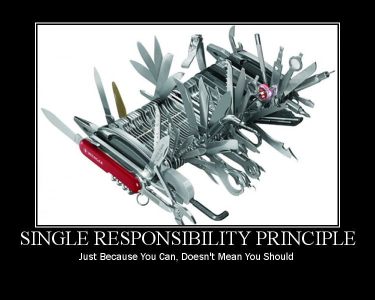

# :alembic: Labs training v1.0.0

Hello there fellow programmer, and welcome to our training repository. Here you will find some topics that we find interesting to learn about.

<!-- TOC -->
- [1. Topics](#1-topics)
  - [1.1. Solid:](#11-solid)
    - [1.1.1. Single Responsability Principle](#111-single-responsability-principle)
    - [1.1.2. Open-Closed Principle](#112-open-closed-principle)
    - [1.1.3. Liskov Sustitution Principle](#113-liskov-sustitution-principle)
    - [1.1.4. Interface Segregation Principle](#114-interface-segregation-principle)
    - [1.1.5. Dependency Inversion Principle](#115-dependency-inversion-principle)
<!-- /TOC -->

## 1. Topics

### 1.1. Solid:

- Exercises:
  - [Java](java/solid/solid-java-1/)

#### 1.1.1. Single Responsability Principle

#### 1.1.2. Open-Closed Principle

#### 1.1.3. Liskov Sustitution Principle

#### 1.1.4. Interface Segregation Principle

#### 1.1.5. Dependency Inversion Principle

